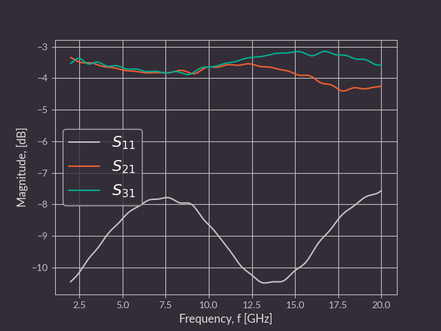
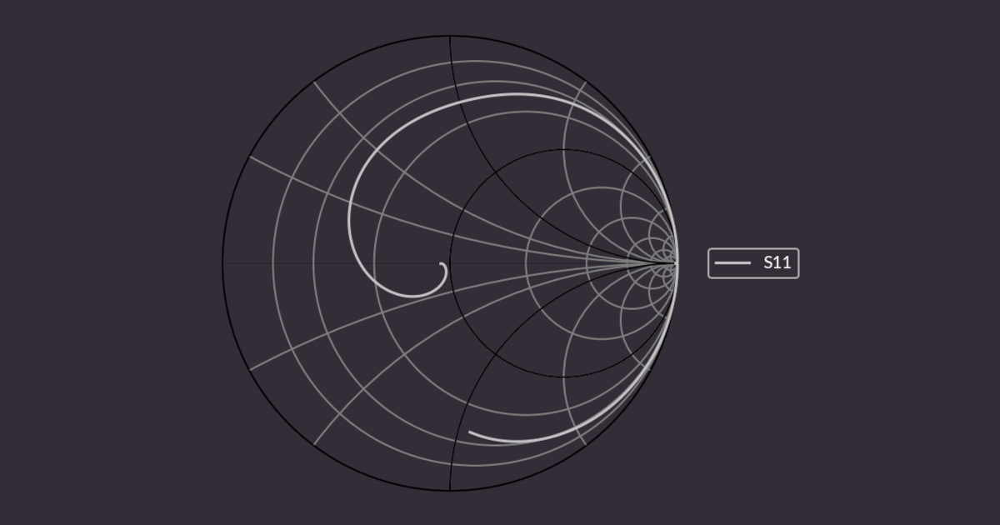
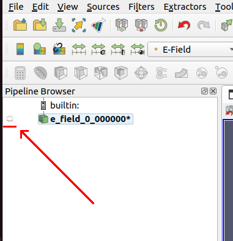
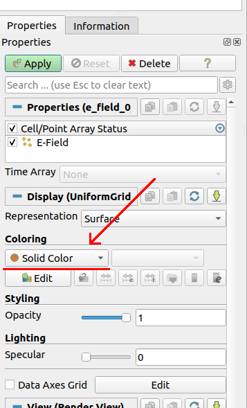
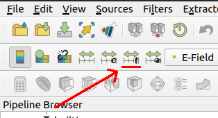
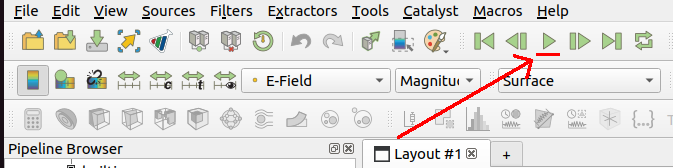

# gerber2ems - openEMS simulation based on Gerber files

Copyright (c) 2023 [Antmicro](https://www.antmicro.com) 

This project aims to streamline signal integrity simulations using open source tools.
It takes PCB production files as input (Gerber, drill files, stackup information) and simulates trace SI performance using openEMS - a free and open electromagnetic field solver that uses the FDTD method.

## Installation

### Required dependencies

#### 1. [OpenEMS](https://www.openems.de/)


Install the following packages (on Debian/Ubuntu):

```bash
build-essential cmake git libhdf5-dev libvtk9-dev libboost-all-dev libcgal-dev libtinyxml-dev qtbase5-dev libvtk9-qt-dev python3-numpy python3-matplotlib cython3 python3-h5py
```

Clone the repository, compile and install OpenEMS:

```bash
git clone --recursive https://github.com/thliebig/openEMS-Project.git
cd openEMS-Project
./update_openEMS.sh ~/opt/openEMS --python
```

#### 2. [Gerbv]()

For Ubuntu/Debian:

```bash
sudo apt install gerbv
```

### Optional dependecies

#### 1. [Paraview](https://www.paraview.org/)

For Ubuntu/Debian:

```bash
sudo apt install paraview
```

### Script installation

To install the script, run the command below in the repository:

```bash
pip install .
```

#### Virtual environment

To install the script along with its Python dependencies inside a virtual environment, follow these steps:

* Create a virtual environment: 
    ```bash
    python -m venv .venv --system-site-packages
    ``` 
* Activate the environment: 
    ```bash
    source .venv/bin/activate
    ```
* Install the script and its python dependencies: 
    ```
    pip install .
    ```
* Deactivate the environment: 
    ```
    deactivate
    ```

For the script to be accessible globally without the need to manually enable the virtual environment, you can create a bash script as follows:

```bash
#!/usr/bin/env bash
source /path/to/repository/.venv/bin/activate
python3 /path/to/repository/src/main.py "$@"
deactivate
```

Then:

* Mark it executable: `chmod +x gerber2ems.sh`
* Add it to your PATH, e.g. `ln -sf "$(pwd)/gerber2ems.sh" "$HOME/.local/bin/gerber2ems"`

Then, you can simply call `gerber2ems` to run the script from any location.

## Usage

For quick lookup, use `gerber2ems --help`.

To simulate a trace, follow these steps:

* Prepare input files and put them in the `fab/` folder (described in detail [here](#pcb-input-files-preparation))
* Prepare the config `simulation.json` file (described in detail [here](#config-preparation))
* Run `gerber2ems -a` (process described [here](#geometry-creation))
* View the results in `ems/results` (described in detail [here](#results))

## Results

This software returns the following types of output:

#### Impedance chart

Plot of each excited port vs. frequency.


#### S-parameter chart

Plot of each S-parameter measured during each excitation.



#### Smith chart

Plot of parameter S-11 for each excitation.



#### S-parameter and impedance data

Impedance and S-parameter data gathered during the simulations, stored in CSV format with a header.

## How it works

### Project preparation

Simulating the whole PCB is extremely resource-intensive, so it is important to separate a region of interest as small in size as possible. 
Uneeded traces, pours etc., should be removed. 
If entire layers are redundant, they can be removed in later steps.

Ports of interest should be marked by a virtual component in positions files. Their designator should begin with "SP" and be followed by port number. 

Origin point for drill files should be placed in bottom-left corner.

Every trace or pour that is somehow terminated in reality and will exist in the simulation should also be terminated using a simulation port or connected to ground.

For now, capacitors are not simulated and, for high frequency simulation, they can be aproximated by shorting them using a trace.

### PCB input files preparation

This script requires multiple input files for geometry creation. 
They should all reside in the "fab" folder and are listed below:

* Gerber files - each simulated copper layer should have a Gerber file named in the following format: "\<optional-text\>-\<name-from-stackup-file\>.gbr"

* Stackup file - a file describing the PCB stackup, named "stackup.json". 
Example format:

```
{
    "layers": [
        {
            "name": "F.Cu",
            "type": "copper",
            "color": null,
            "thickness": 0.035,
            "material": null,
            "epsilon": null,
            "lossTangent": null
        },
        {
            "name": "dielectric 1",
            "type": "core",
            "color": null,
            "thickness": 0.2,
            "material": "FR4",
            "epsilon": 4.5,
            "lossTangent": 0.02
        }
    ],
    "format_version": "1.0"
}
```

* Drill file - Drill file in excellon format with plated through-holes. 
Filename should end with "-PTH.drl"
* Position file - File describing positions of ports. 
Filename should end with "-pos.csv". 
Example line:

```
# Ref     Val              Package                PosX       PosY       Rot  Side
SP1       Simulation_Port  Simulation_Port      3.0000    11.7500  180.0000  top
```

### Config preparation

The `simulation.json` file configures the entire simulation. 
You can find sample files in the `example_gerbers` folder. 
All dimensions in this file are specified in **micrometers**. 
This config file constitutes of three sections:

##### Miscellaneous

* `format_version` - specifies the format of the config file
When writing a new config, it should be the newest supported version (visible in the `constants.py` file)
* `frequency` - `start` specifies the lowest frequency of interest and `stop` the highest (in MHz)
* `max_steps` - max number of simulation steps after which the simulation will stop unconditionally
* `via/plating_thickness` - via plating thickness (micrometers)
* `via/filling_epsilon` - dielectric constant of the material the vias are filled in with
If they are not filled in, it should be 1
* `margin/xy` - margin size in x and y directions (micrometers)
* `margin/z` - margin size in z direction (micrometers).

##### Mesh

* `xy` - mesh grid pitch in x and y direction (micrometers)
* `inter_layers` - number of mesh lines in z direction between neighbouring PCB layers
* `margin/xy` - mesh grid pitch in x and y direction (micrometers) outside of the board area
* `margin/z` - mesh grid pitch in z direction (micrometers) outside of the board area.

##### Ports

`ports` is a list of ports. Each port has the following parameters:

* `width` - width of the port (micrometers)
* `length` - length of the port (ports are currently composed of microstripline fragments whose length should be at least 8x mesh cell size) (micrometers)
* `impedance` - terminating impedance of the port (impedance of driver or receiver) (Ohms)
* `layer` - the number of the copper layer where the port is located (counting from the top)
* `plane` - the number of the copper layer where the reference plane of the microstrip is located (counting from the top)
* `excite` - whether the simulator should use this port as an input port (for multiple excited ports, they will be excited in separate simulations).

### Geometry creation

This is an automatic step done with the `-g` flag.
The script locates all the files needed for creating the geometry (Gerbers, drill files, pnp files, stackup file, simulation config file).
Then it converts Gerber files to PNG using gerbv.
The PNG's are then processed into triangles and input into the geometry.
This also adds via geometries as well as port geometries.
Everything is placed on correct Z heights using the stackup file.

You can view the generated geometry which is saved to `ems/geometry/geometry.xml` using AppCSXCAD (installed during OpenEMS installation).

### Simulation

This is an automatic step commenced with the `-s` flag.
The script loads the geometry and config files. 
It inputs all the information into the engine and starts the simulations, iterating over every "excited" port.

At this step, the user should verify if the indicated number of timesteps is enough. 
The engine recommends that it should be at least 3x as long as the pulse:

```
Excitation signal length is: 3211 timesteps (3.18343e-10s)
Max. number of timesteps: 10000 ( --> 3.11429 * Excitation signal length)
```

The simulator converts the geometry into voxels and starts solving the Maxwell equations for each edge in the mesh.
It does that for a number of timesteps (maximum number specified in config) and then exits.
For each timestep, electric field data from planes between copper planes is saved to files in the `ems/simulation` folder. Port voltage and current data is also saved.

During the simulation, one of the ports is exited using a gaussian pulse (wideband frequency content).
This pulse traverses the network and exits using ports (it can also get emitted outside the board). 

You can monitor the simulation by looking at the engine output:

```
[@ 20s] Timestep: 4620 || Speed:  294.4 MC/s (3.372e-03 s/TS) || Energy: ~4.16e-16 (- 7.15dB)
```
This way you can see:
* What timestep you are on, 
* How many mesh voxels per second the simulator processes 
* How much energy is left in the system. 
The energy should drop during the simulation as it exits through the ports (after the excitation pulse ends), however due to inaccuracies and energy radiated it won't drop to 0.

After the simulation finishes, the user can verify the data using `Paraview` (described in a [section below](#paraview)).

### Postprocessing

This is an automatic step commenced with the `-p` flag.
The script is loaded in the simulator data for each excited port. 
It then computes an FFT to get data in the frequency domain. 
It then converts the incident and reflected wave data to impedance and S parameters. 
These are saved in CSV format in the `ems/results/S-parameters` folder. 
This data is also automatically plotted and the plots are saved to `ems/results`.

## Paraview

To view simulation data in Paraview, follow these steps:

* Open Paraview
* Load the data you are interested in (File->Open...)
The files are located in `ems/simulation/<port_number>/e_field_<layer_number>_..vtr`
* Display the data using the eye symbol in the "Pipeline Browser" on the left side of the window



* Change `Coloring` to `E-Field` in the "Properties" window on the left side



* Rescale to data range using an icon in the second bar from the top



* Press Play to play the animation - first icon bar from the top



## Licensing

This project is published under the [Apache-2.0](LICENSE) license.
