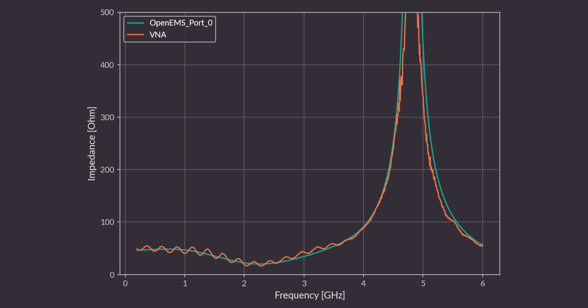

# gerber2ems - openEMS simulation based on Gerber files

Copyright (c) 2023-2025 [Antmicro](https://www.antmicro.com)

This project is a Python script that aims to streamline signal integrity simulations using open source tools.
It takes PCB production files as input (Gerber, drill files, stackup information) and simulates trace SI performance using [openEMS](https://github.com/thliebig/openEMS-Project/) - a free and open source electromagnetic field solver that uses the FDTD method.

## Installation

### [OpenEMS](https://www.openems.de/)


Install the following packages (on Debian/Ubuntu):

```bash
sudo apt update
sudo apt install build-essential cmake git libhdf5-dev libvtk9-dev libboost-all-dev libcgal-dev libtinyxml-dev qtbase5-dev libvtk9-qt-dev python3-numpy python3-matplotlib cython3 python3-h5py python3-setuptools
```

Clone the repository, compile and install openEMS:

It is recommended to use the `bb991bb3` commit, as this is the latest one tested with gerber2ems.
```bash
git clone https://github.com/thliebig/openEMS-Project.git
pushd ./openEMS-Project
git checkout bb991bb3
git submodule update --init --recursive
./update_openEMS.sh ~/opt/openEMS --python
popd
```

### Script installation

1. Install the dependencies:
```bash
sudo apt install gerbv paraview python3.11 pipx
pipx ensurepath
```

2. Clone and install gerber2ems
```bash
git clone https://github.com/antmicro/gerber2ems.git
pushd ./gerber2ems
pipx install --system-site-packages .
popd
```

You can test `gerber2ems` with built-in examples.
The examples are slices of our open hardware [Signal Integrity Test Board](https://openhardware.antmicro.com/boards/si-simulation-test-board/), which were generated using the [KiCad SI wrapper](https://github.com/antmicro/kicad-si-simulation-wrapper).
Selected examples contain VNA measurements in dedicated vna.csv files, which allows us to compare openEMS simulation results with real life measurements.
```bash
cd ./gerber2ems/examples/stub_short
gerber2ems -a
```

## Usage

For quick lookup, use `gerber2ems --help`.

To simulate a trace, follow these steps:

* Prepare input files and put them in the `fab/` folder (described in detail in the [PCB Input File Preparation section](#pcb-input-files-preparation))
* Prepare the config `simulation.json` file (described in detail in the [Config Preparation section](#config-preparation))
* Run `gerber2ems -a` (process described in the [Geometry Creation section](#geometry-creation))
* View the results in `ems/results` (described in detail in the [Results section](#results))
* Run `gerber2ems -a --export-field` and use Paraview to view an animation of the E-field (described in detail in the [Paraview section](#paraview))

## Results

The simulation output of the `stub_short` example is shown below.
This software returns the following types of output:

### S-parameter and impedance data

Impedance and S-parameter data gathered during the simulations, stored in CSV format with a header.

### S-parameter chart

Plot of each S-parameter measured during each excitation.


### Smith chart

Plot of parameter S-11 for each excitation.


### Impedance chart

Plot of each excited port vs. frequency.


The `stub_short` example contains a `vna.csv` file, which can be used to verify simulation results.



## How it works

### Project preparation

Simulating an entire PCB is extremely resource-intensive, so it is important to separate a region of interest as small in size as possible - unneeded traces, pours etc., should be removed. 
If entire layers are redundant, you can remove them in later steps.

Ports of interest should be marked by a virtual component in positions files. Their designator should begin with "SP" and be followed by port number. 

Origin point for drill files should be placed in bottom-left corner.

Every trace or pour that is somehow terminated in reality and will exist in the simulation should also be terminated using a simulation port or connected to ground.

For now, capacitors are not simulated and, for high frequency simulation, they can be aproximated by shorting them using a trace.

### PCB input file preparation

This script requires multiple input files for geometry creation. 
They should all reside in the "fab" folder and are listed below:

* Gerber files - each simulated copper layer should have a corresponding Gerber file named in the following format: "\<optional-text\>-\<name-from-stackup-file\>.gbr"

* Stackup file - a file describing the PCB stackup, named "stackup.json". 
Example format:

    ```
    {
        "layers": [
            {
                "name": "F.Cu",
                "type": "copper",
                "color": null,
                "thickness": 0.035,
                "material": null,
                "epsilon": null,
                "lossTangent": null
            },
            {
                "name": "dielectric 1",
                "type": "core",
                "color": null,
                "thickness": 0.2,
                "material": "FR4",
                "epsilon": 4.5,
                "lossTangent": 0.02
            }
        ],
        "format_version": "1.0"
    }
    ```

* Drill file - Drill file in excellon format with plated through-holes.
Filename should end with "-PTH.drl"

* Position file - File describing positions of ports.
  * Filename should end with "-pos.csv"
  * Coordinates should be given in relation to bottom left corner
  * The area of the port is calculated using the formulas in the table below, based on the `Width` and `Length` values from the `simulation.json` file:

    | Rotation [°] | `X` span                       | `Y` span                       | Wave travel direction |
    | ------------ | ------------------------------ | ------------------------------ | --------------------- |
    | 0            | `(PosX-Width/2, PosX+Width/2)` | `(PosY, PosY+Length)`          | Along `Y`             |
    | 90           | `(PosX-Length, PosX)`          | `(PosY-Width/2, PosY+Width/2)` | Opposite to `X`       |
    | 180          | `(PosX-Width/2, PosX+Width/2)` | `(PosY-Length, PosY)`          | Opposite to `Y`       |
    | 270          | `(PosX, PosX+Length)`          | `(PosY-Width/2, PosY+Width/2)` | Along `X`             |

  * Example file:

    ```
    # Ref     Val              Package                PosX       PosY       Rot  Side
    SP1       Simulation_Port  Simulation_Port      3.0000    11.7500  180.0000  top
    ```

### Config preparation

The `simulation.json` file configures the entire simulation. 
You can find sample files in the `example_gerbers` folder. 
All dimensions in this file are specified in **micrometers**. 
This config file consists of three sections:

#### Miscellaneous

* `format_version` - specifies the format of the config file
When writing a new config, it should be the newest supported version (visible in the `constants.py` file)
* `frequency` - `start` specifies the lowest frequency of interest and `stop` the highest (in Hz)
* `max_steps` - max number of simulation steps after which the simulation will stop unconditionally
* `pixel_size` - size of pixel in microns. Used during gerber conversion (default: 5) (due to a limitation of libcairo, this needs to be increased for larger boards, but try to keep as low as possible)
* `via/plating_thickness` - via plating thickness (micrometers)
* `via/filling_epsilon` - dielectric constant of the material the vias are filled in with
If they are not filled in, it should be 1

#### Grid

* `inter_layers` - number of grid lines in Z axis between neighboring PCB layers (default: 4)
* `optimal` - basic mesh grid pitch (micrometers) (used for cells on metal edge) (default: 50)
* `diagonal` - mesh grid pitch (micrometers) (used for regions with diagonal paths) (default: 50)
* `perpendicular` - mesh grid pitch (micrometers) (used for regions with paths perpendicular to grid) (default: 200)
* `max` - maximum mesh grid pitch (micrometers) (used outside of the board area) (default: 500)
* `cell_ratio/xy` - optimal neighboring cell size ratio (X/Y axis) (default: 1.2)
* `cell_ratio/xy` - optimal neighboring cell size ratio (Z axis) (default: 1.5)
* `margin/xy` - margin size in X/Y axis (micrometers) (how far beyond pcb the grid spreads) (default: 1000)
* `margin/z` - margin size in Z axis (micrometers) (default: 1000).
* `margin/from_trace` - Limit simulation space based on nets-of-interest bounding box (default: True) (if False, board b-box is used).

Grid pitch options should follow `optimal`<=`diagonal`<=`perpendicular`<=`max`<=`λmin/10`

#### Ports

`ports` is a list of ports. Each port has the following parameters:

* `width` - width of the port (micrometers)
* `length` - length of the port (ports are currently composed of microstripline fragments whose length should be at least 8x mesh cell size) (micrometers)
* `impedance` - terminating impedance of the port (impedance of driver or receiver) (Ohms)
* `layer` - the number of the copper layer where the port is located (counting from the top)
* `plane` - the number of the copper layer where the reference plane of the microstrip is located (counting from the top)
* `excite` - whether the simulator should use this port as an input port (for multiple excited ports, they will be excited in separate simulations).

#### differential_pairs/traces

`differential_pairs`/`traces` are lists of simulated signals. Each signal can have following fields:

* `start_p`, `stop_p`, `start_n`, `stop_n` - port numbers used for signal (differential_pair)
* `start`, `stop` - port numbers used for signal (single ended trace)
* `name` - optional name that allows to identify the signal
* `nets` - list of nets to be included during grid generation (e.g. `["/CSI_A_CLK_N","/CSI_A_CLK_P"]`). If not specified, data from `netinfo.json` file will be used. In case the file is also not present, all nets (except GND) will be considered during grid generation.  

### Geometry creation

This is an automatic step commenced with the `-g` flag.
The script locates all the files needed for creating the geometry (Gerbers, drill files, pnp files, stackup file, simulation config file).
Then it converts Gerber files to PNG using gerbv.
The PNG's are then processed into triangles and input into the geometry.
This also adds via geometries as well as port geometries.
Everything is placed on correct Z heights using the stackup file.

You can view the generated geometry, which is saved to `ems/geometry/geometry.xml`, using AppCSXCAD (installed during openEMS installation).

### Simulation

This is an automatic step commenced with the `-s` flag.
The script loads the geometry and config files. 
It inputs all the information into the engine and starts the simulations, iterating over every excited port.

At this step, the user should verify if the indicated number of timesteps is sufficient. 
The engine recommends that it should be at least 3x as long as the pulse:

    ```
    Excitation signal length is: 3211 timesteps (3.18343e-10s)
    Max. number of timesteps: 10000 ( --> 3.11429 * Excitation signal length)
    ```

The simulator converts the geometry into voxels and starts solving Maxwell equations for each edge in the mesh.
It does that for a number of timesteps (maximum number specified in config) and then exits.
For each timestep, electric field data from planes between copper planes is saved to files in the `ems/simulation` folder. Port voltage and current data is also saved.

During the simulation, one of the ports is excited using a gaussian pulse (wideband frequency content).
This pulse traverses the network and exits using ports (it can also get emitted outside the board). 

You can monitor the simulation by looking at the engine output:

    ```
    [@ 20s] Timestep: 4620 || Speed:  294.4 MC/s (3.372e-03 s/TS) || Energy: ~4.16e-16 (- 7.15dB)
    ```
This way you can see:
* what timestep you are on
* how many mesh voxels per second the simulator processes 
* how much energy is left in the system

The energy should drop during the simulation as it exits through the ports (after the excitation pulse ends), however due to inaccuracies and energy radiated it won't drop to 0.

After the simulation finishes, the user can verify the data using `Paraview` (described in a [section below](#paraview)).

### Postprocessing

This is an automatic step commenced with the `-p` flag.
The script loads simulation data for each excited port. 
It then computes an FFT to get data in the frequency domain. 
It then converts the incident and reflected wave data to impedance and S parameters. 
These are saved in CSV format in the `ems/results/S-parameters` folder. 
This data is also automatically plotted and the plots are saved to `ems/results`.

## Paraview

To view simulation data in Paraview, follow these steps:

* Run `gerber2ems -a --export-field <dump locations>`
* Run `ems2paraview <port>`

`<port>` is a simulated port number, defined in the `simulation.json`,
to list all available ports use: `ems2paraview -l`

`dump locations` can be skipped (dump at all possible locations), or be one or more keywords from:

* `outer` - dump field 100 um above board surface
* `cu-outer` - dump field on outer cooper Z-position
* `cu-inner` - dump field on inner cooper Z-position
* `substrate` - dump field on the middle of each dielectric layer

`--oversampling <int num>` - can be added to increase frequency of exporting field (normally OpenEMS dumps field once per few hundreds timesteps) (`<int num>` defaults to 4)

> [!WARNING]  
> Field exports can easily take hundreds GB of storage

## Licensing

This project is published under the [Apache-2.0](LICENSE) license.
